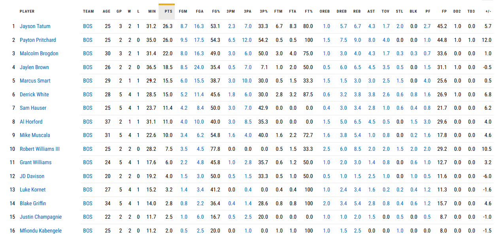
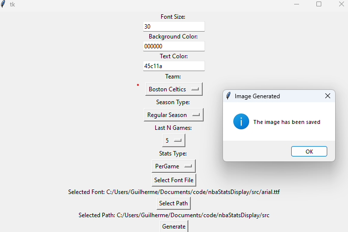

# nbaStatsDisplay

This is a repository for displaying NBA stats in different forms. The current roadmap is below. The [NBA_API](https://github.com/swar/nba_api) is how the data is collected.

## Roadmap

- [X] Develop a news ticker 
- [ ] Verify possible errors and bugs in the ticker as well as make it x-platform
- [ ] Develop something similar to the ticker but now generating multiple images based on a list of players. Should provide the headshot picture of the players and their stats below (e.g: First to the floor stuff)

## NBA Stats Ticker

This is a stats ticker for podcasts/content creation. As currently built it generates a single "line" ticker with all the players of the selected team and time period. For example for the last 5 games of the *Regular Season* of the Boston Celtics the __per game__ averages where the following:

Which then generated the following:

### Usage

To use the software you can go from the [source code]() or the [released version](https://github.com/guilhermetheis/nbaStatsDisplay/releases/tag/v1.0.0). Currently only Windows is supported. To then use the software you need a few things:

* A [TrueType Font](https://fileinfo.com/extension/ttf) to define exactly the font you are using
* The color in a Hexadecimal format for your font (currently the background is bugged so using all zeros is the recomended)
* Select the path you want to save the image to
* The font size you wish to use

Everything else is a drag menu so its somewhat intuitive. The parameters are limited. The image will be saved with the naming as such `YYYYMMDD Team Name.png`. The below image is an example of how it should look (using the released version):

